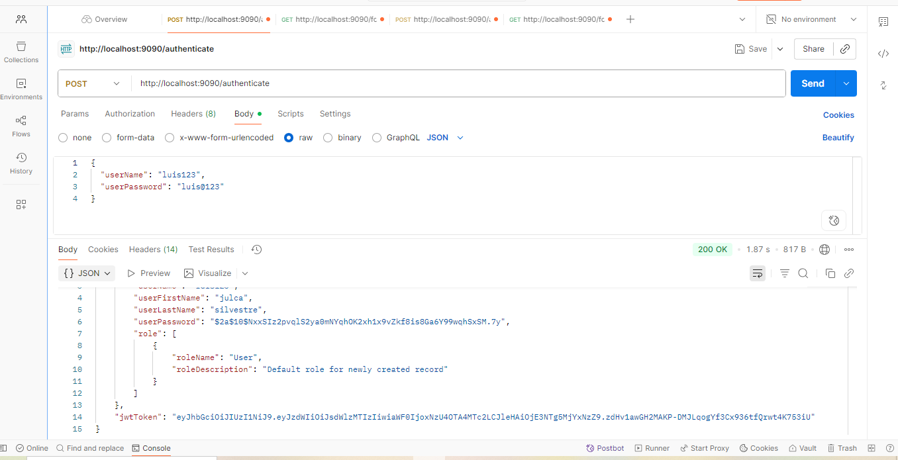
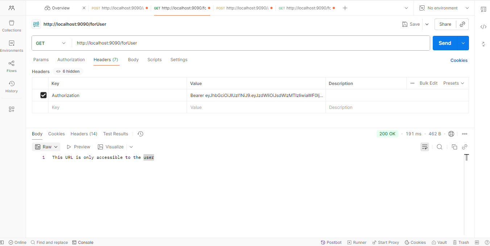
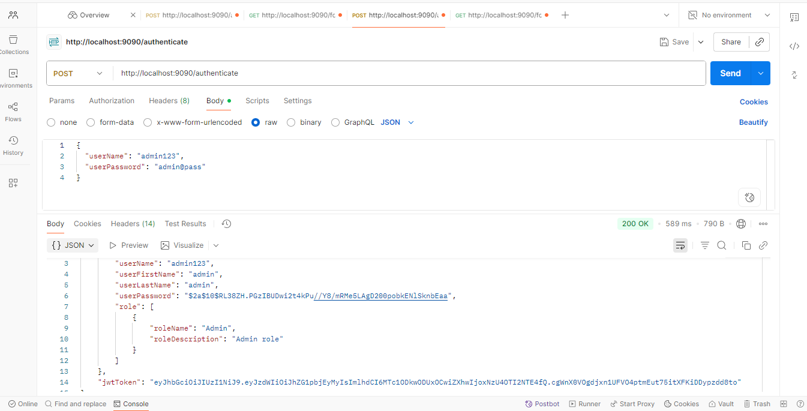
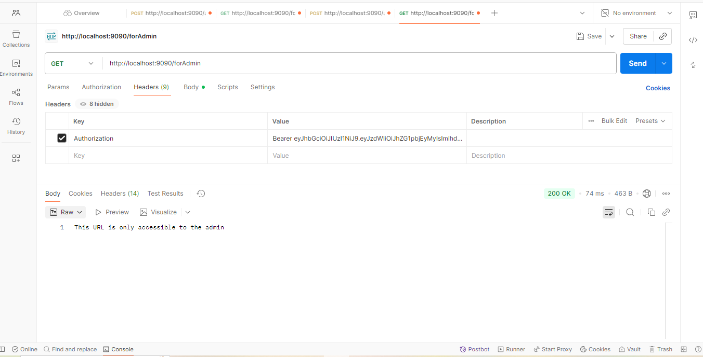

# backecom
API REST con SpringBoot implementando autenticación y autorización con JWT

#Tecnologías usadas:

-Java

-SpringBoot

-SpringSecurity

-JWT(Json Web Token)

-Maven

-Lombok

-JPA

-MySQL

#Estructura del proyecto:
src/main/java/com/tu/empresa/backecom
- config -> configuración de seguridad, filtros JWT
- controller -> endpoints REST
- dao -> entidades (usuario, role)
- entity -> interfaces de acceso a datos
- service -> lógica de negocio
- util -> generación / validación de tokens JWT

#Como ejecutar localmente
1. Clona el repositorio:
git clone https://github.com/LuisJS05/backecom.git

2. Ingresa el directorio:
cd backecom

3. Buil y run con Maven:
mvn clean install
mvn spring-boot:run

4. El servidor arrancara en:
http://localhost:9090

#Imagen de Autenticación de Usuario

#Imagen de Acceso a Usuario

#Imagen de Autenticaicon de Admin

#Imagen de Acceso a Admin

